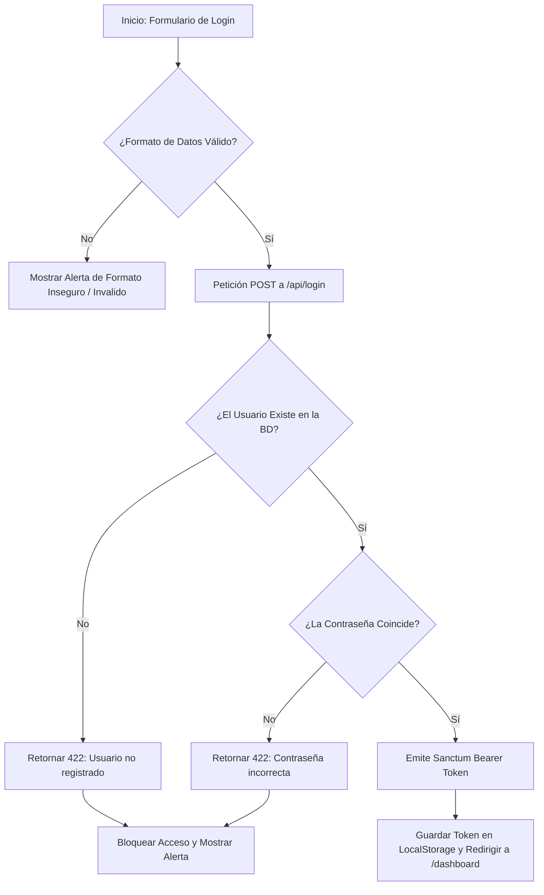

# 🔒 Documentación de Validación de Login y Registro Seguro - CleverNote

Este documento especifica las reglas de formato seguro de datos, el flujo de verificación previa de usuarios y la arquitectura de autenticación implementada en producción para la plataforma **CleverNote** (desplegada en VPS bajo HTTPS: `https://clevernote.duckdns.org`).

---

## 🎯 1. Reglas de Validación de Formato Seguro

Tanto la API REST en Laravel (`/backend/app/Http/Controllers/AuthController.php`) como los componentes cliente en React (`LoginView.jsx` y `RegisterView.jsx`) aplican validaciones estrictas de formato antes de procesar cualquier solicitud:

### A. Correo Electrónico (`email`)
- Debe cumplir con una estructura de correo válida: `usuario@dominio.com`.
- Se valida mediante expresión regular y la regla `email` de Laravel.

### B. Contraseña Segura (`password`)
Para garantizar la protección de las cuentas, las contraseñas deben cumplir obligatoriamente con los siguientes requisitos de complejidad:
- **Longitud mínima**: 8 caracteres.
- **Letra mayúscula**: Al menos un carácter en mayúscula (`A-Z`).
- **Letra minúscula**: Al menos un carácter en minúscula (`a-z`).
- **Número**: Al menos un dígito numérico (`0-9`).

**Patrón Regex Aplicado**:
```regex
/^(?=.*[a-z])(?=.*[A-Z])(?=.*\d).{8,}$/
```

*Si la contraseña no cumple con esta estructura, el sistema detiene el proceso y muestra:*
> ⚠️ *"La contraseña debe tener al menos 8 caracteres, incluir al menos una letra mayúscula, una minúscula y un número."*

---

## 🛡️ 2. Flujo de Autenticación y Verificación Previa de Usuarios

Para evitar que usuarios no registrados o con credenciales inválidas accedan a la interfaz `/dashboard`, la lógica del login sigue un proceso secuencial de 4 pasos:



### Paso 1: Validación de Formato
Se verifica en el cliente que el correo y la contraseña cumplan con las reglas de seguridad descritas en la Sección 1.

### Paso 2: Detección Previa de Existencia del Usuario (Backend / BD MySQL)
La API consulta a la base de datos de producción en el VPS:
```php
$user = User::where('email', $request->email)->first();
```
- **Si el usuario NO existe**: Se retorna una respuesta HTTP 422 con el mensaje:
  > ❌ *"El usuario no se encuentra registrado. Regístrate primero."*
- **Efecto**: El acceso al dashboard queda completamente **bloqueado**.

### Paso 3: Verificación de Contraseña Cifrada (Bcrypt)
Si el usuario existe, la API valida el hash de la contraseña:
```php
Hash::check($request->password, $user->password)
```
- **Si la contraseña NO coincide**: Se retorna una respuesta HTTP 422 con el mensaje:
  > ❌ *"La contraseña ingresada es incorrecta."*
- **Efecto**: El acceso al dashboard queda completamente **bloqueado**.

### Paso 4: Otorgamiento de Acceso y Token Sanctum
Si el usuario existe y la contraseña es correcta, la API expide un `plainTextToken` Bearer y responde con HTTP 200:
```json
{
  "message": "Inicio de sesión exitoso",
  "user": { "id": 1, "name": "Usuario", "email": "usuario@correo.com" },
  "access_token": "1|token_hash_sanctum...",
  "token_type": "Bearer"
}
```
El cliente React almacena el token en `localStorage` (`clevernote_token`) e inicia la sesión navegando hacia `/dashboard`.

---

## 👤 3. Visualización Dinámica de las Credenciales del Usuario

Anteriormente, el componente `<Navbar>` en el Dashboard mostraba el nombre estático de muestra `"Moisés"`.

Se refactorizó `DashboardLayout.jsx` para consumir dinámicamente el hook `useAuth()` de la aplicación:
```javascript
const { user } = useAuth();
const displayName = typeof user === 'object' && user !== null
  ? (user.name || user.fullName || (user.email ? user.email.split('@')[0] : 'Usuario'))
  : (typeof user === 'string' && user ? user : 'Usuario');
```

**Resultado**:
- La esquina superior derecha (Navbar) obtiene automáticamente el nombre del usuario autenticado (API o LocalStorage).
- El icono del avatar en el Navbar extrae la inicial en mayúscula de dicho usuario de forma dinámica (`displayName.charAt(0)`).

## 🌐 3. Resiliencia y Modo Offline / Local

En caso de que el entorno cliente se encuentre sin conexión a Internet o el backend esté temporalmente inaccesible durante pruebas locales:
1. `RegisterView.jsx` guarda el registro en la lista local `clevernote_registered_users` dentro del navegador.
2. `LoginView.jsx` consulta `clevernote_registered_users`. Si el correo ingresado **no fue previamente registrado en esa lista**, se deniega el acceso mostrando *"El usuario no se encuentra registrado. Regístrate primero."*

---

## 🚀 4. Integración con el Despliegue en VPS

Toda esta lógica se encuentra operando en el entorno de producción configurado en la guía del VPS:
- **URL Base de la API**: `https://clevernote.duckdns.org/api`
- **Endpoint de Registro**: `POST https://clevernote.duckdns.org/api/register`
- **Endpoint de Login**: `POST https://clevernote.duckdns.org/api/login`
- **Protocolo de Seguridad**: HTTPS con cifrado TLS 1.3 mediante Certbot (Let's Encrypt).
